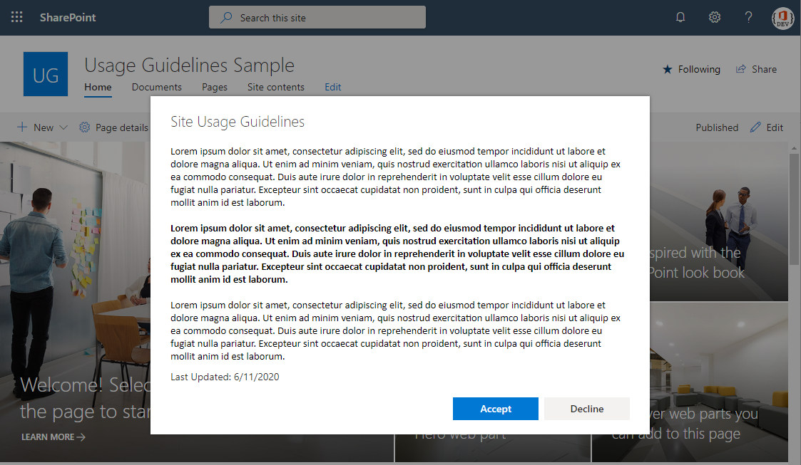

## Site Usage Guidelines

Require site users to accept usage guidelines in order to use a SharePoint site collection. The usage guideline configuration and responses are maintained within SharePoint lists.

## Setup Instructions
### Pre-requisites
- App Catalog: Ensure the [App Catalog](https://docs.microsoft.com/en-us/sharepoint/use-app-catalog) is setup in your SharePoint Online tenant

### Solution Installation
1. Download the SPFx package [site-usage-guidelines.sppkg](https://github.com/bschlintz/spfx-usageguidelines/blob/master/sharepoint/solution/site-usage-guidelines.sppkg) file from Github (or clone the repo and build the package yourself)
    > __Tip__: Click on the link, then click Download. On Windows, you may need to unblock the file after downloading otherwise the package will be corrupt when uploading to SharePoint. To verify, right-click on the .sppkg file, then click Properties, then look for an 'Unblock' checkbox at the bottom. Tick the box and click OK. If you don't see the checkbox, then no action is required.
2. Upload sppkg file to the 'Apps for SharePoint' library in your Tenant App Catalog
3. Click Deploy

### Solution Updates
Follow the same steps as installation. Overwrite the existing package in the 'Apps for SharePoint' library when uploading the new package. 

> __Tip__: Be sure to check-in the sppkg file after the deployment if it is left checked-out.

### Site Installation
1. Navigate to the SharePoint site collection where you want to enable this functionality.
2. From the page command bar 'New' drop-down or settings gear, click 'Add an App'.
3. Click 'Site Usage Guidelines' from the 'Apps you can add' section to install the app within your site. This step creates two lists: `UsageGuidelinesConfig` and `UsageGuidelinesTracking`.
4. Navigate to the `UsageGuidelinesTracking` list settings. Break the list permissions to stop inheriting the from site. Configure the list permissions to allow the site visitors group the ability to add items to the list.
    > __Security Tip__: Create a new site permission level called 'Add Items Only'. Assign this permission level to the site visitors group on the `UsageGuidelinesTracking` list.
5. While in the `UsageGuidelinesTracking` list settings, click on 'Advanced Settings'. Set `Read access` to `Read items that were created by the user` and `Create and Edit access` to `Create items and edit items that were created by the user`. These two settings will prevent users from seeing other user acknowledgements if they were to navigate directly to this list.
6. Navigate to the `UsageGuidelinesConfig` list. Update the default list item to configure the usage guidelines message, version, header text. Once finished, set the item's `Enabled` field to true. This will begin prompting site users to acknowledge the usage guidelines.

## Reference

### New or Updated Usage Guidelines
Two approaches to manage the usage guidelines configuration.
1. Update the default usage guidelines item with a newer `Message` and `Message Version`. As long as the `Message Version` is numerically greater than the `Acknowledged Version` the user last accepted, they will be prompted to re-acknowledge the new usage guidelines after their cache expires (see Caching) or they use a new browser.
2. Create a new usage guidelines item for each new version. As long as the `Message Version` is newer than the other items and it is marked 'Enabled', users will be prompted to re-acknowledge the usage guidelines after their cache expires (see Caching) or they use a new browser.

### Caching
The solution will cache 'Accepted' responses in the user's browser using [local storage](https://developer.mozilla.org/en-US/docs/Web/API/Web_Storage_API) which expires on the last day of the current month. If the usage guidelines version changes during this time, the user will not be prompted to acknowledge the new guidelines until the beginning of the next month.

### Re-acknowledgement
Once per year, users will be prompted to re-acknowledge the usage guidelines even if they've accepted them previously and the version has not changed. For example, let's assume Bob accepts the usage guidelines on June 11, 2020 and the usage guidelines will not change in the next year. If Bob visits the site after June 1, 2021, he will be prompted to re-acknowledge the usage guidelines. This ensures the user is prompted within 365 days of the original acknowledgement.

## Disclaimer

Microsoft provides programming examples for illustration only, without warranty either expressed or implied, including, but not limited to, the implied warranties of merchantability and/or fitness for a particular purpose. We grant You a nonexclusive, royalty-free right to use and modify the Sample Code and to reproduce and distribute the object code form of the Sample Code, provided that You agree: (i) to not use Our name, logo, or trademarks to market Your software product in which the Sample Code is embedded; (ii) to include a valid copyright notice on Your software product in which the Sample Code is embedded; and (iii) to indemnify, hold harmless, and defend Us and Our suppliers from and against any claims or lawsuits, including attorneys' fees, that arise or result from the use or distribution of the Sample Code.
